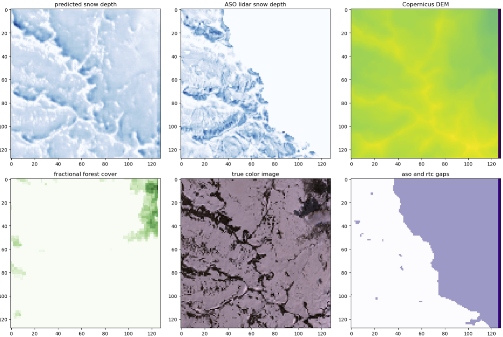

# deep-snow
### Machine learning models for Sentinel-1 SAR backscatter snow depth retrieval

### Collaborators
* Quinn Brencher, gbrench@uw.edu
* Eric Gagliano, egagli@uw.edu

2023 GeoSMART Hackweek team:
- Bareera Mirza
- Ibrahim Alabi
- Dawn URycki
- Taylor Ganz
- Abner Bogan
- Mansa Krishna
- Taryn Black
- Will Rosenbluth
- Yen-Yi Wu
- Fadji Maina
- Hui Gao
- Jacky Chen Xu
- Nicki Shobert
- Kathrine Udell-Lopez

2024 NASA Earth Sciences and UW Hackweek team:
- Ekaterina (Katya) Bashkova
- Manda Chasteen
- Sarah Kilpatrick
- Isabella Chittumuri
- Kavita Mitkari
- Shashank Bhushan (Helper)
- Adrian Marziliano (Helper)

### The problem
Seasonal snow provides drinking water for billions, but current global measurements of snow depth lack adequate spatial and temporal resolution for effective resource management--especially in mountainous terrain. Recent work has demonstrated the potential to retrieve snow-depth measurements from Sentinel-1 synthetic aperture radar (SAR) backscatter data. However, comparisons with airborne lidar data suggest that existing snow depth retrieval algorithms fail to capture the full complexity of relationships between snow depth, terrain, vegetation, and SAR backscatter, the physics of which are poorly understood. We suggest that a machine learning model may be able to effectively learn these relationships and retrieve snow depth from SAR backscatter with improved accuracy. 

During the 2023 GeoSMART Hackweek, the deep-snow team trained a convolutional neural network to predict snow depth ([see results here](https://docs.google.com/presentation/d/160eq-O48m0FuJgghCHZ4Idysb9zokbMF6Qd1E3HJJww/edit?usp=sharing)). Initial results are promising! But this model needs to be improved, validated, and applied. 



### Project goals
The overarching goal for this hackweek is to improve our snow depth prediction model such that it outperforms the initial model implemented last year. This is an ongoing machine learning project with opportunities to contribute at various stages in the project lifecycle! 

#### General goals 
- improve hyperparameters, model architecture, and input selection
- perform model validation and testing
- apply model to predict snow depth in new areas
- improve visualizations

#### Stretch goals
- Create a snow depth map at peak snow water equivalent 2023 for the entire western U.S (or some large area within it)
- Compare snow depth results to SNOTEL/[spicy-snow](https://github.com/SnowEx/spicy-snow) measurements
- Develop a tool that takes a date range and a bounding box and produces a snow depth time series using our model

#### Other goals
- implement some way to track experiments
- perform sensitivity analysis to quantify the importance of each input

### Data
Our dataset includes:
- Sentinel-1 RTC backscatter data (snow on and snow off)
- Sentinel-2 imagery (snow on)
- Fractional forest cover
- COP30 digital elevation model
- Airborne Snow Observatory (ASO) lidar snow depth maps

Snow-on Sentinel-1 and 2 data were collected nearby in time to corresponding ASO acquistions. All products were reprojected to the appropriate UTM zone and resampled to a matching 50 m grid. Products were divided up spatially into training, testing, and validation tiles and subset to produce a machine-learning ready dataset. Our training dataset includes ~37,000 image stacks, each of which includes all of the above listed inputs. 

### Installation
Download and install Miniconda Set up Mamba
```
$ conda install mamba -n base -c conda-forge
```
Clone the repo and set up the environment
```
$ git clone https://github.com/geo-smart/deep-snow.git
$ cd ./deep-snow
$ mamba env create -f environment.yml
$ conda activate deep-snow
```
Install the package locally
```
$ pip install -e .
```

### Additional resources or background reading
- [spicy-snow background](https://github.com/SnowEx/spicy-snow/blob/main/contrib/brencher/tutorial/01background.ipynb)
- [spicy-snow paper](https://egusphere.copernicus.org/preprints/2024/egusphere-2024-1018/egusphere-2024-1018.pdf)
- [Lievens et al. (2022) paper](https://tc.copernicus.org/articles/16/159/2022/) 
- [SAR basics](https://asf.alaska.edu/information/sar-information/what-is-sar/)
- [More SAR basics](https://www.earthdata.nasa.gov/learn/backgrounders/what-is-sar)
- [Sentinel-1 SAR](https://sentinels.copernicus.eu/web/sentinel/user-guides/sentinel-1-sar)
- [More on ASF HyP3 RTC](https://hyp3-docs.asf.alaska.edu/guides/rtc_product_guide/)
- [SAR theory from 2022 UNAVCO InSAR class (more advanced)](https://nbviewer.org/github/parosen/Geo-SInC/blob/main/UNAVCO2022/0.8_SAR_Theory_Phenomenology/SAR.ipynb)
